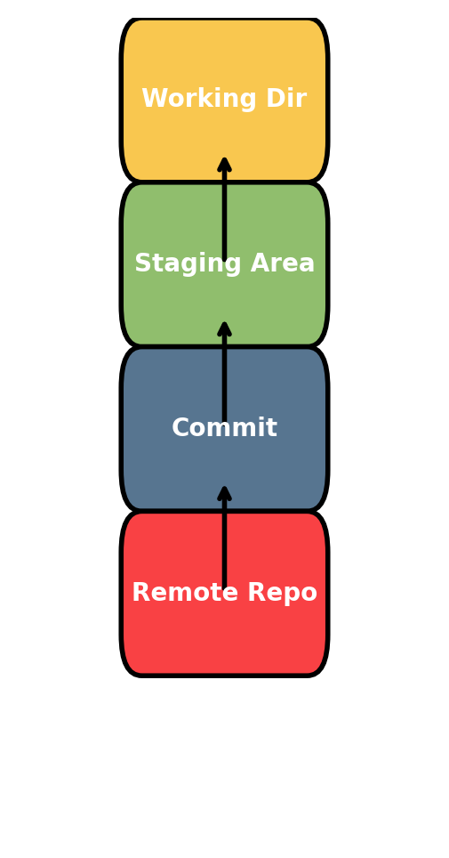
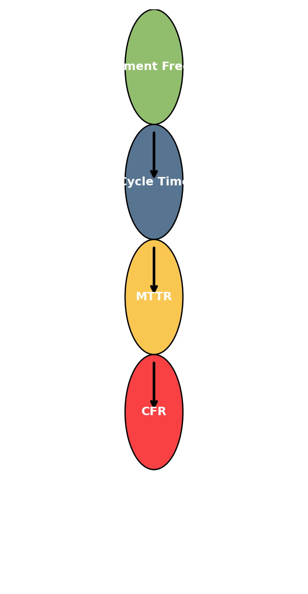
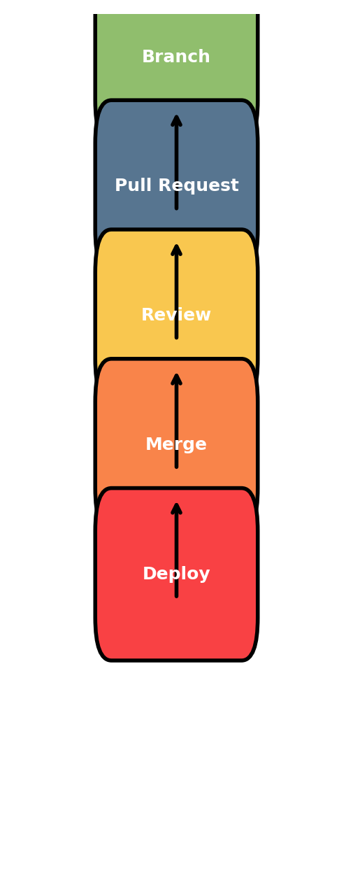
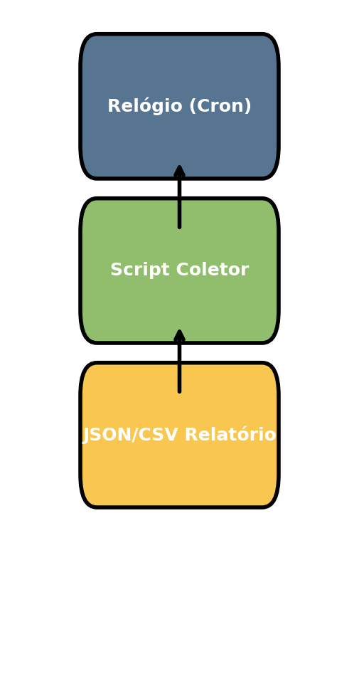

# 📘 Livro de Métricas de Engenharia com Git

Este repositório contém um guia completo para coleta, análise e visualização de **métricas de engenharia de software** a partir de dados do **Git** e plataformas como **GitHub**, **Azure DevOps** e **Bitbucket**.

---

## 📖 Introdução

O **Git** é um sistema de controle de versão distribuído que permite colaboração entre desenvolvedores, versionamento de código e rastreamento de mudanças ao longo do tempo.  
Os dados armazenados em commits, branches, PRs e pipelines podem ser utilizados para **extrair métricas de performance de engenharia**.

Essas métricas ajudam a responder perguntas como:
- Com que frequência o time entrega código?
- Quanto tempo leva para uma mudança ir do commit até o deploy?
- Quanto tempo demora para revisar um PR?
- Qual o tempo médio de recuperação de falhas (MTTR)?

### Fluxo Git Básico


---

## 📊 Capítulo 1 - Métricas de Engenharia

Cada métrica tem um **objetivo**, um **modo de cálculo** e pode ser **melhorada com práticas ágeis e engenharia de software**.

### Exemplos:
- **Commit Frequency**  
  - Objetivo: medir cadência de commits  
  - Como funciona: contagem de commits no período  
  - Como melhorar: commits pequenos, integração contínua

- **Cycle Time**  
  - Objetivo: tempo do primeiro commit até o merge do PR  
  - Como funciona: análise de PRs mesclados  
  - Como melhorar: PRs menores, revisões rápidas

- **MTTR (Mean Time To Recovery)**  
  - Objetivo: tempo para corrigir falhas  
  - Como funciona: PRs com label `bug` ou `fix`  
  - Como melhorar: priorizar correções críticas, CI/CD com rollback rápido


- **Commit Frequency (Frequência de Commits)**
    - Objetivo: Contar quantos commits foram feitos em um intervalo.
    - Comandos Git:
      - git log --since="2025-01-01" --until="2025-01-31" --pretty=format:"%h"
      - git rev-list --count HEAD
    - O primeiro retorna commits no período; o segundo conta commits totais.

- **Coding Time (Tempo de Codificação)**
    - Objetivo: Calcular o tempo entre o primeiro e o último commit do período.
    - Comandos Git:
        - git log --since="2025-01-01" --until="2025-01-31" --pretty=format:"%ci"
    - Depois pega a menor e a maior data e calcula a diferença em horas.

  - **Code Metrics (Adições e Deleções de Código)**
    - Objetivo: Medir proporção de código adicionado/removido.
    - Comandos Git:
      - git log --since="21 days ago" --numstat --pretty="%H"
    - Isso mostra adições/deleções por commit. Somando os valores, você calcula os percentuais.

  - **Cycle Time (Tempo de Ciclo)**
    - Objetivo: Tempo entre o primeiro commit e o merge do PR.
    - Necessita PRs (GitHub/GitLab API).
    - Comandos Git (base local):
      - git log <branch> --pretty=format:"%ci"   # data do primeiro commit
    - O merge do PR em si geralmente vem de API (ex: gh pr list --state merged --json createdAt,mergedAt).

  - **Review Time (Tempo de Revisão)**
    - Objetivo: Tempo entre criação/atualização do PR e o merge.
    - Necessita API de PRs (GitHub/GitLab).
    - Com GitHub CLI:
      - gh pr list --state merged --json createdAt,updatedAt,mergedAt

  - **Pickup Time (Tempo até revisão começar)**
    - Objetivo: Tempo entre criação do PR e quando foi pego para revisão.
    - Necessita reviewers → só disponível em API.
    - Com GitHub CLI:
      - gh pr list --json createdAt,updatedAt,reviewRequests

  - **Deployment Frequency (Frequência de Deploys)**
    - Objetivo: Quantos PRs foram mesclados (assumindo merge = deploy).
    - Com GitHub CLI:
      - gh pr list --state merged --json mergedAt
      - Ou, se houver tags/releases:
      - git tag --sort=-creatordate

  - **Deploy Time (Tempo até ir para Produção)**
    - Objetivo: Tempo entre merge do PR e publicação da release.
    - Com GitHub CLI:
      - gh pr list --state merged --json mergedAt
      - gh release list --json publishedAt
    - Com Git puro:
      - git log --merges --pretty=format:"%ci %s"
      - git tag --format="%(creatordate:iso8601) %(refname:short)"

  - **MTTR (Mean Time to Recovery)**
    - Objetivo: Tempo médio entre abertura e merge de PRs com label bug ou fix.
    - Com GitHub CLI:
      - gh pr list --label bug --state merged --json createdAt,mergedAt
      - gh pr list --label fix --state merged --json createdAt,mergedAt

  - **CFR (Change Failure Rate)**
    - Objetivo: Proporção de PRs que tiveram label failure ou rollback.
    - Com GitHub CLI:
      - gh pr list --label failure --state merged --json number
      - gh pr list --label rollback --state merged --json number
      - gh pr list --state merged --json number   # total

  - **Resumo**
    - commitFrequency (Git) – contagem de commits no período
    - codingTimeHours (Git) – horas entre o primeiro e o último commit do período
    - codeMetrics (Git) – adições/remoções e percentuais em “recent” (por padrão últimos 21 dias) vs “old”
    - cycleTimeHoursAvg (GitHub) – média de horas do primeiro commit do PR até o merge
    - reviewTimeHoursAvg (GitHub) – média de horas de updatedAt/createdAt até o merge
    - pickupTimeHoursAvg (GitHub) – média de horas de createdAt até a primeira “pega” (proxy updatedAt)
    - deploymentFrequency (GitHub) – contagem de PRs mesclados no período
    - deployTimeHoursAvg (GitHub) – média de horas de merge do PR até a primeira release publicada após o merge
    - mttrHoursAvg (GitHub) – média de horas de PRs com label bug ou fix (abertura → merge)
    - cfrPercent (GitHub) – % de PRs mesclados com labels failure ou rollback sobre o total mesclado

### Diagrama Métricas DORA


---

## 💻 Capítulo 2 - Comandos dos Scripts

### Comandos Git
```bash
git log --since --until --pretty=format:"%ci"
git rev-list --count HEAD
git log --numstat
```

### GitHub CLI
```bash
gh pr list --state merged --json createdAt,mergedAt
gh release list --json publishedAt
```

### Azure CLI
```bash
az repos pr list --status completed
az pipelines runs list --pipeline-ids <id>
```

### Bitbucket API
```bash
curl -u $BB_USER:$BB_APP_PASS "https://api.bitbucket.org/2.0/repositories/{workspace}/{repo_slug}/pullrequests?state=MERGED"
```

### Trecho do `git_metrics_unified.sh` (GitHub)
```bash
gh_list_merged_prs() {
  gh pr list --repo "$1" --state merged --search "merged:>=$SINCE merged:<=$UNTIL" --limit 200     --json number,createdAt,updatedAt,mergedAt,labels,title,author,url
}
```

### Fluxo de Pull Request


---

## ⏱️ Capítulo 3 - Automação com Cron

### Exemplo de agendamento
```bash
# Rodar diariamente às 19h
0 19 * * * /caminho/git_metrics_daily_unified.sh --repo-path "/caminho/repo" --provider github --repo "owner/name"
```

### Trecho do runner (`git_metrics_daily_unified.sh`)
```bash
OUT_DIR="$REPO_PATH/reports/$SINCE"
JSON_OUT="$OUT_DIR/metrics_${PROVIDER}.json"
CSV_SERIES="$REPO_PATH/reports/metrics_daily_${PROVIDER}.csv"

"$METRICS_SH" "${ARGS[@]}" > "$JSON_OUT"
```

### Fluxo Cron


---

## ⚙️ Capítulo 4 - Pré-condições de Instalação

```bash
# Git
sudo apt install git

# jq
sudo apt install jq

# GitHub CLI
sudo apt install gh
gh auth login

# Azure CLI
curl -sL https://aka.ms/InstallAzureCLIDeb | sudo bash
az extension add --name azure-devops

# Bitbucket (curl)
sudo apt install curl
export BB_USER="seu_usuario"
export BB_APP_PASS="seu_app_password"
```

---

## 📈 Capítulo 5 - Grafana

O **Grafana** é uma ferramenta de observabilidade e dashboards.  
Aqui vamos usá-lo para visualizar os arquivos CSV/JSON de métricas.

### Instalação no Ubuntu
```bash
sudo apt-get install -y software-properties-common
sudo mkdir -p /etc/apt/keyrings/
wget -q -O - https://packages.grafana.com/gpg.key | sudo gpg --dearmor -o /etc/apt/keyrings/grafana.gpg
echo "deb [signed-by=/etc/apt/keyrings/grafana.gpg] https://packages.grafana.com/oss/deb stable main" | sudo tee /etc/apt/sources.list.d/grafana.list
sudo apt-get update && sudo apt-get install grafana -y
sudo systemctl enable grafana-server
sudo systemctl start grafana-server
```

### Datasource CSV
```bash
sudo grafana-cli plugins install marcusolsson-csv-datasource
sudo systemctl restart grafana-server
```

### Dashboard JSON (exemplo `metrics_dashboard_grafana.json`)
```json
{
  "title": "Engineering Metrics Dashboard",
  "panels": [
    {
      "title": "Cycle Time (hours)",
      "type": "timeseries",
      "targets": [ { "fields": ["cycleTimeHoursAvg"] } ]
    }
  ]
}
```

---

## 🔹 Capítulo 6 - Bitbucket

### Coleta de PRs
```bash
curl -u $BB_USER:$BB_APP_PASS \
  "https://api.bitbucket.org/2.0/repositories/{workspace}/{repo_slug}/pullrequests?state=MERGED"
```

### Coleta de Pipelines
```bash
curl -u $BB_USER:$BB_APP_PASS \
  "https://api.bitbucket.org/2.0/repositories/{workspace}/{repo_slug}/pipelines/"
```

### Trecho do `git_metrics_unified.sh` (Bitbucket)
```bash
bb_list_prs_merged_json() {
  curl -s -u "$BB_USER:$BB_APP_PASS" "$BB_API/repositories/$BB_WORKSPACE/$BB_REPO_SLUG/pullrequests?state=MERGED&pagelen=50"     | jq '.values'
}
```

---

## 👥 Capítulo 7 - Métricas por Repositório e Autor

Além das métricas por repositório, também é possível gerar métricas **por autor**.

### Exemplo de CSV
```csv
date,repo,author,commitFrequency,codingTimeHours,cycleTimeHoursAvg,reviewTimeHoursAvg,pickupTimeHoursAvg
2025-01-01,org/repo,Maria|maria@empresa.com,12,3.5,24.2,10.1,5.0
```

### Trecho do `git_metrics_by_author.sh`
```bash
git_commit_count_by_author() {
  git log --since="$SINCE" --until="$UNTIL" --author="$1" --pretty=oneline | wc -l
}
```

### Dashboard por Autor (`metrics_dashboard_by_author.json`)
```json
{
  "title": "Engineering Metrics by Repo & Author",
  "templating": {
    "list": [
      { "name": "repo", "type": "textbox", "label": "Repo" },
      { "name": "author", "type": "textbox", "label": "Author" }
    ]
  }
}
```

---

## 📎 Notas Finais

- Scripts completos:  
  - [git_metrics_unified.sh](git_metrics_unified.sh)  
  - [git_metrics_daily_unified.sh](git_metrics_daily_unified.sh)  
  - [git_metrics_by_author.sh](git_metrics_by_author.sh)  
- Dashboards:  
  - [metrics_dashboard_grafana.json](metrics_dashboard_grafana.json)  
  - [metrics_dashboard_by_author.json](metrics_dashboard_by_author.json)  

As imagens dos diagramas (`diagram_git_flow.png`, `diagram_dora.png`, `diagram_pr_flow.png`, `diagram_cron.png`) devem estar no mesmo diretório do README.md.

---

✍️ Autor: Nelson Abu  
📅 Última atualização: 2025
